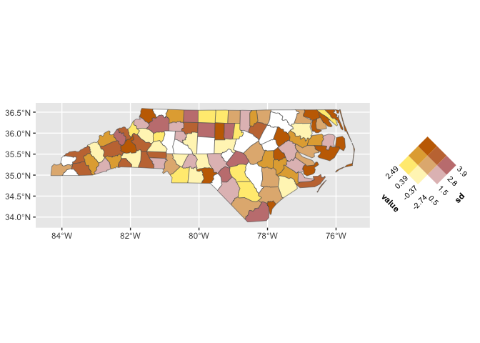
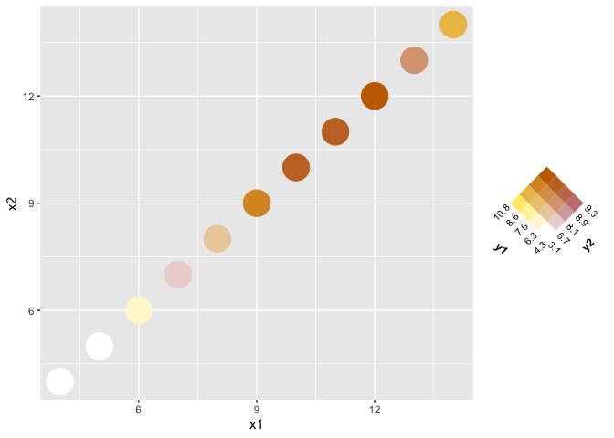

<!-- README.md is generated from README.Rmd. Please edit that file -->

# ggincerta

<!-- badges: start -->

<!-- badges: end -->

The goal of ggincerta is to extend ggplot2 with specialized layers to
simplify spatial uncertainty visualization.

## Installation

You can install the development version of ggfuzzy from
[GitHub](https://github.com/) with:

``` r
# install.packages("pak")
pak::pak("maggiexma/ggincerta")
```

## Example

``` r
library(ggincerta)
#> Loading required package: ggplot2
```

The package works for any geom :D

``` r
ggplot(nc) +
  geom_sf(aes(fill = duo(value, sd)))
```



``` r


ggplot(anscombe, aes(x1, x2)) +
  geom_point(aes(color = duo(y1, y2)), size = 10)
```


