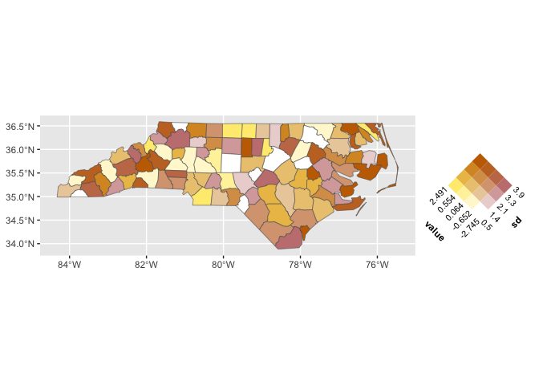
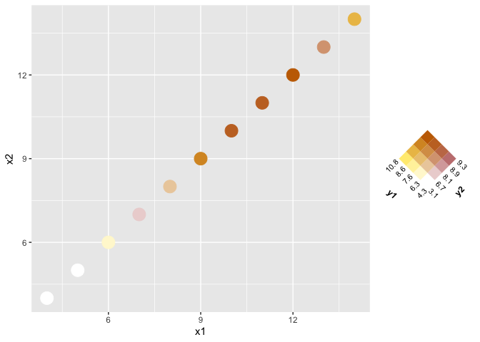
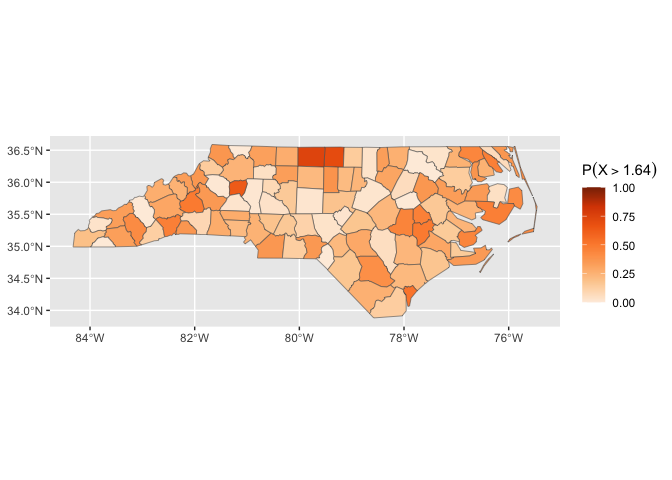
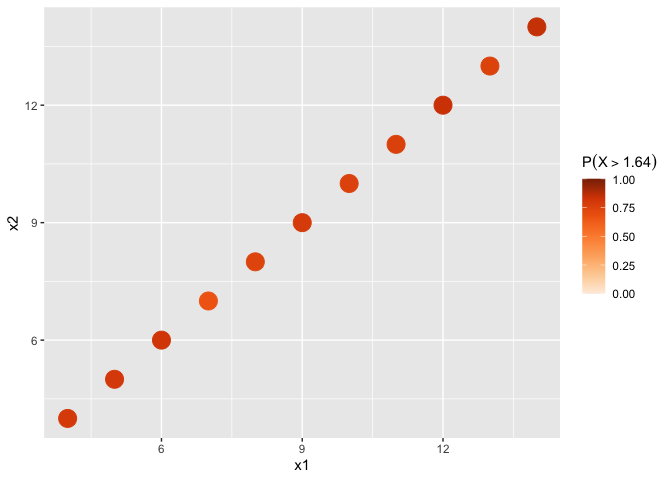

<!-- README.md is generated from README.Rmd. Please edit that file -->

# ggincerta

<!-- badges: start -->

[](https://CRAN.R-project.org/package=ggincerta)
[](https://github.com/maggiexma/ggincerta/actions/workflows/R-CMD-check.yaml)
[](https://app.codecov.io/gh/maggiexma/ggincerta)
<!-- badges: end -->

## Overview

ggincerta is an extension of ggplot2 that introduces new layers and
scales for visualizing spatial uncertainty, and can be extended to more
general bivariate schemes. It reimplements the visualization methods for
four types of maps introduced in the Vizumap package in a way that fully
aligns with the grammar of graphics and integrates seamlessly with the
ggplot2 ecosystem, making the visualization process more flexible and
convenient.

## Installation

``` r
# Install the release from CRAN:
install.packages("ggincerta")

# Install the development version from GitHub:
# install.packages("pak")
pak::pak("maggiexma/ggincerta")
```

## Usage

The example dataset included in ggincerta is an sf object adapted from
the `nc` shapefile in the sf package. It contains two simulated columns
value and sd, which are mainly used in example maps to demonstrate how
to visualize visualize regional uncertainty alongside average estimates.
For more details about the description and design of four map types, see
<https://doi.org/10.1002/sta4.150>.

``` r
library(ggincerta)
#> Loading required package: ggplot2
```

The ggincerta package defines two layer functions `geom_sf_pixel()` and
`geom_sf_glyph()` for creating pixel and glyph maps, respectively. They
can be used in the same way as other `geom_*()` functions in ggplot2,
like `geom_point()`.

``` r
ggplot(nc) + geom_sf_pixel(mapping = aes(v1 = value, v2 = sd))
```


Two variables `v1` and `v2`, are required in the mapping for a glyph
map. They are visually transformed into a pixel representation, where
pixel values are sampled from a specified probability distribution
parameterized by `v1` and `v2` for each region and then mapped to the
colour aesthetic. A greater variation in pixel colors within a region
indicates higher uncertainty.

``` r
ggplot(nc) + geom_sf_glyph(mapping = aes(v1 = value, v2 = sd))
```


Glyph maps are essentially centroid maps that require two guides: `v1`
is conventionally mapped to the colour aesthetic and shown with a
continuous colourbar, while `v2` is mapped to the rotation angle of
glyph.

The designs of both the bivariate map and the exceedance probability map
are primarily reflected in their colour mapping schemes. The scale
function `scale_*_bivariate()` discretizes each variable into `n_breaks`
bins, maps these bins to corresponding colour ramps, and generates a
colour grid in which each cell represents the joint bin from the two
variables.

``` r
ggplot(nc) + geom_sf(aes(fill = duo(value, sd)))
```

 This
scale can be applied to data types other than sf objects.

``` r
ggplot(anscombe, aes(x1, x2)) +
  geom_point(aes(color = duo(y1, y2)), size = 6)
```

 Like
`scale_*_bivariate()`, `scale_*_exceed()` in ggincerta can be applied to
data types beyond sf. Note that it currently computes exceedance
probabilities under a normal distribution only, taking the first
variable as mean and the second as standard deviation with a default
threshold of 1.64. To change the threshold, call `scale_*_exceed()`
explicitly and pass the desired arguments.

``` r
ggplot(nc) + geom_sf(aes(fill = duo_exceed(value, sd)))
```



``` r
ggplot(anscombe, aes(x1, x2)) +
  geom_point(aes(color = duo_exceed(y1, y2)), size = 6)
```


