# ggincerta

## Overview

`ggincerta` is an extension of ggplot2 for visualising uncertainty in
spatial data and, more generally, for constructing bivariate
visualisations. It reimplements the visualisation methods for three map
types introduced in the `Vizumap` package within the grammar of
graphics, while also providing additional uncertainty visualisation
approaches.

The package integrates directly with ggplot2 through custom scales,
geoms, aesthetics, and guides. This allows uncertainty visualisations to
be constructed, combined, and customised using the same workflow as
conventional ggplot2 graphics.

## Installation

``` r

# Install the release from CRAN:
install.packages("ggincerta")

# Install the development version from GitHub:
# install.packages("pak")
pak::pak("maggiexma/ggincerta")
```

## Usage

The example dataset included in `ggincerta` is an sf object adapted from
the `nc` shapefile in the `sf` package. It contains two simulated
variables, `value` and `sd`, which are used throughout the examples to
demonstrate how regional estimates and uncertainty can be visualised
simultaneously.

For more details on the original visualisation designs implemented from
`Vizumap`, see <https://doi.org/10.1002/sta4.150>.

``` r

library(ggincerta)
#> Loading required package: ggplot2
```

### Bivariate colour map

`ggincerta` provides `scale_*_bivariate()` for constructing bivariate
colour scales that can be used with
[`duo()`](https://maggiexma.github.io/ggincerta/reference/duo.md) inside
ggplot2 aesthetics. Two variables are discretised independently, and
their crossed bin combinations are mapped to a two-dimensional colour
grid.

By default, automatically generated breaks use `breaks_pretty()` on the
transformed scale. The `n_breaks` argument specifies the desired number
of bins, but when `nice.breaks = TRUE`, the actual number of bins may
differ in order to produce more readable break values.

``` r

ggplot(nc) + geom_sf(aes(fill = duo(value, sd)))
```

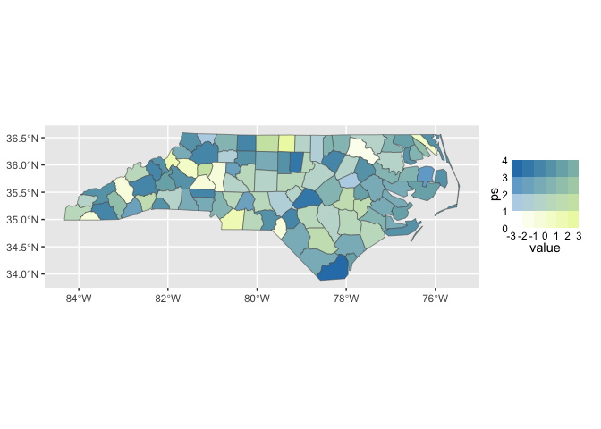

If an exact number of equal-width bins is required, set
`nice.breaks = FALSE`. Quantile-based binning is also available by
setting `quantile = TRUE`.

``` r

ggplot(nc) +
  geom_sf(aes(fill = duo(value, sd))) +
  scale_fill_bivariate(
    n_breaks = 4,
    nice.breaks = FALSE
  )
```

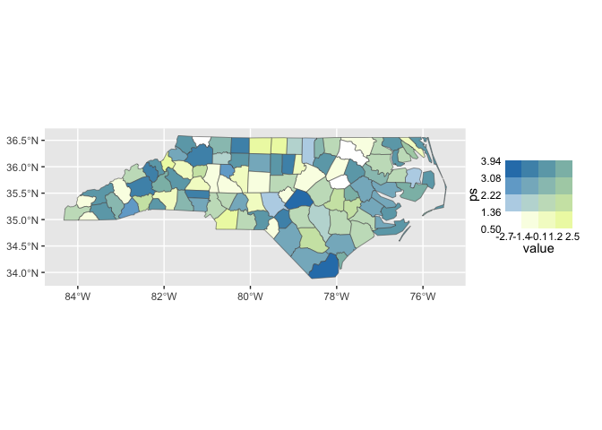

The default palette is generated by mixing two colour ramps. Alternative
palette functions can be supplied through `palette_fun`. For example,
[`bivar_fade_palette()`](https://maggiexma.github.io/ggincerta/reference/bivar_fade_palette.md)
can be used to emphasise one variable while progressively suppressing
another perceptual dimension along the second axis.

``` r

ggplot(nc) +
  geom_sf(aes(fill = duo(value, sd))) +
  scale_fill_bivariate(
    palette_fun = bivar_fade_palette,
    colours = c("#F6E8C3", "orange", "red"),
    palette_params = list(fade = "desaturate")
  )
```

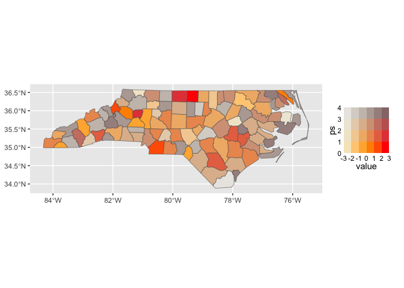

For complete control over the colour grid, `ggincerta` also provides
manual bivariate scales. Manual scales use exact equal-width bins by
default, so the number of required colours is determined directly by
`n_breaks`.

Value-Suppressing Uncertainty Palettes (VSUPs), proposed by Correll et
al. (2018), suppress value differences as uncertainty increases. In
`ggincerta`, they are implemented through `scale_*_vsup()`.

The uncertainty variable is divided into a hierarchy of layers, while
the number of value bins varies across those layers according to the
branch parameter. When breaks are not supplied, both value and
uncertainty breaks are generated as equal-width intervals on the
transformed scale.

``` r

ggplot(nc) +
  geom_sf(aes(fill = duo(value, sd))) +
  scale_fill_vsup()
```

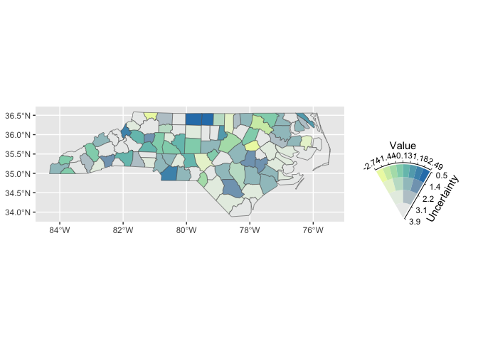

Custom breaks and limits can also be supplied explicitly.

``` r

ggplot(nc) +
  geom_sf(aes(fill = duo(value, sd))) +
  scale_fill_vsup(
    breaks = list(
      seq(-3, 3, length.out = 9),
      seq(0, 4, length.out = 5)
    ),
    limits = list(
      c(-3, 3),
      c(0, 4)
    )
  ) +
  theme(
    legend.text = element_text(size = 7)
  )
```

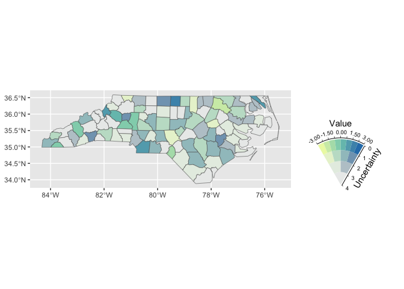

### Pixel maps

`ggincerta` provides
[`geom_sf_pixel()`](https://maggiexma.github.io/ggincerta/reference/geom_sf_pixel.md)
for constructing pixel maps. Each spatial unit is tessellated into
pixels, with pixel values sampled from a specified probability
distribution parameterised by the mapped variables.

Pixel grids can be generated using rectangular, square, or hexagonal
cells, with hexagonal pixels used by default. Variation in pixel colours
within a region provides a visual representation of uncertainty while
retaining the spatial pattern of the underlying estimate.

Because pixel generation relies on geometric intersection, computation
can be slower when working directly with geographic sf objects under the
s2 geometry system. For improved performance, it is recommended to first
transform the data to a projected planar coordinate reference system.

``` r

nc_flat <- sf::st_transform(nc, 3857)

ggplot(nc_flat) +
  geom_sf_pixel(
    mapping = aes(fill = duo_pixel(value, sd)),
    seed = 123
  )
```

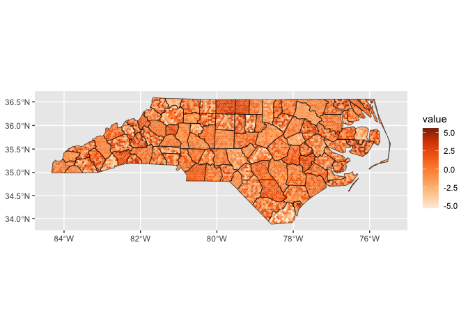

The pixel shape and resolution can also be customised by `pixel_shape`.

``` r

ggplot(nc_flat) +
  geom_sf_pixel(
    mapping = aes(fill = duo_pixel(value, sd)),
    pixel_shape = "square",
    n = 30,
    seed = 123
  )
```

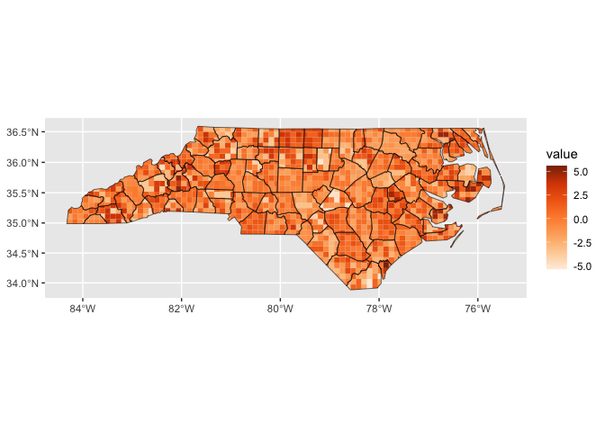

### Glyph maps

Glyph maps use additional graphical marks placed at spatial centroids to
represent value and uncertainty. `ggincerta` provides several glyph
forms through
[`geom_sf_glyph()`](https://maggiexma.github.io/ggincerta/reference/geom_sf_glyph.md).

Regular shapes such as circles, squares, triangles, and hexagons can be
used with bivariate colour scales.

``` r

ggplot(nc_flat) +
  geom_sf_glyph(
    mapping = aes(colour = duo(value, sd))
  )
#> Warning: st_point_on_surface assumes attributes are constant over geometries
```

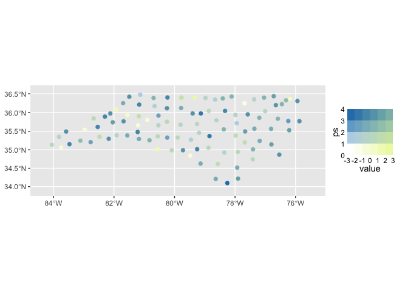

Drop-shaped glyphs provide an alternative encoding in which uncertainty
can be represented by rotation through the `angle` aesthetic.

``` r

ggplot(nc_flat) +
  geom_sf_glyph(
    aes(colour = value, angle = sd),
    shape = "drop"
  )
#> Warning: st_point_on_surface assumes attributes are constant over geometries
```

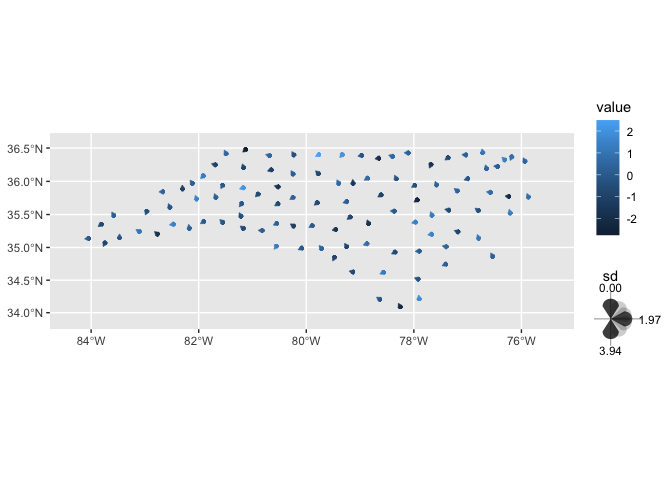

Chernoff faces provide another glyph form for multivariate encoding. The
implementation in `ggincerta` builds on the grob and scale design
provided by the `ggChernoff` package. In the example below, facial
colour represents the estimated value, while facial expression
represents uncertainty: lower uncertainty produces smiling faces,
whereas higher uncertainty produces frowning faces.

``` r

ggplot(nc_flat) +
  geom_sf_glyph(
    aes(colour = value, smile = sd),
    shape = "chernoff"
  )
```

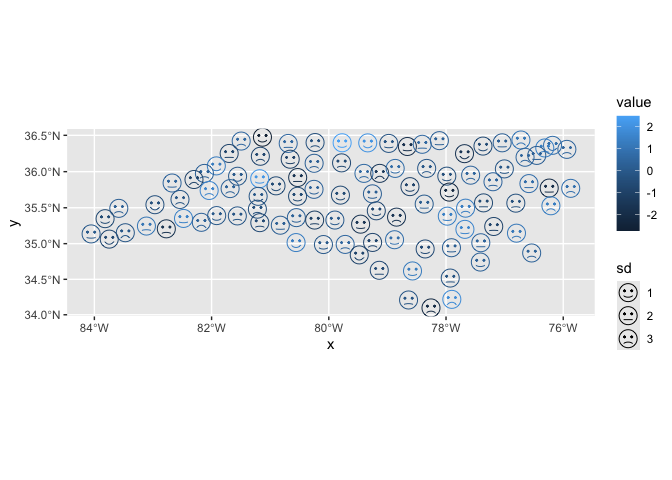

### Dual map

The dual map combines a conventional choropleth layer with a glyph layer
in the same spatial display. The two layers can use separate aesthetics,
scales, and guides, allowing the primary variable and uncertainty to
remain visually distinct and directly interpretable.

A simple dual map can, for example, map uncertainty to polygon fill and
the estimated value to glyph colour.

``` r

ggplot(nc_flat) +
  geom_sf_dualmap(
    aes(fill = sd, colour = value)
  )
#> Warning: st_point_on_surface assumes attributes are constant over geometries
```

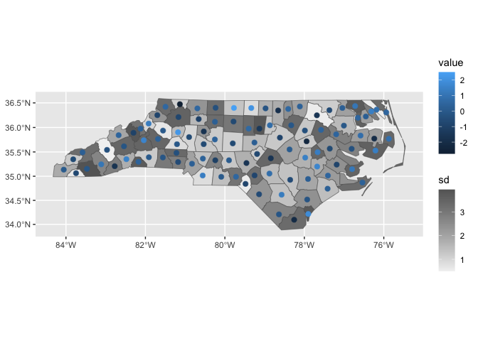

Because the choropleth and glyph components are layered within the
ggplot2 system, they can also be combined with bivariate mappings. This
makes it possible to encode an additional variable through
[`duo()`](https://maggiexma.github.io/ggincerta/reference/duo.md) while
retaining a separate glyph-based representation.

``` r

ggplot(nc_flat) +
  geom_sf_dualmap(
    aes(
      fill = duo(value, sd),
      colour = value
    )
  ) +
  scale_colour_gradient(low = "grey95", high = "grey40") +
  scale_fill_bivariate()
#> Warning: st_point_on_surface assumes attributes are constant over geometries
```

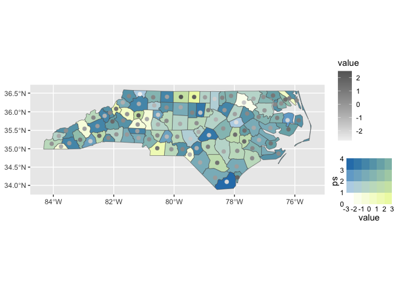
